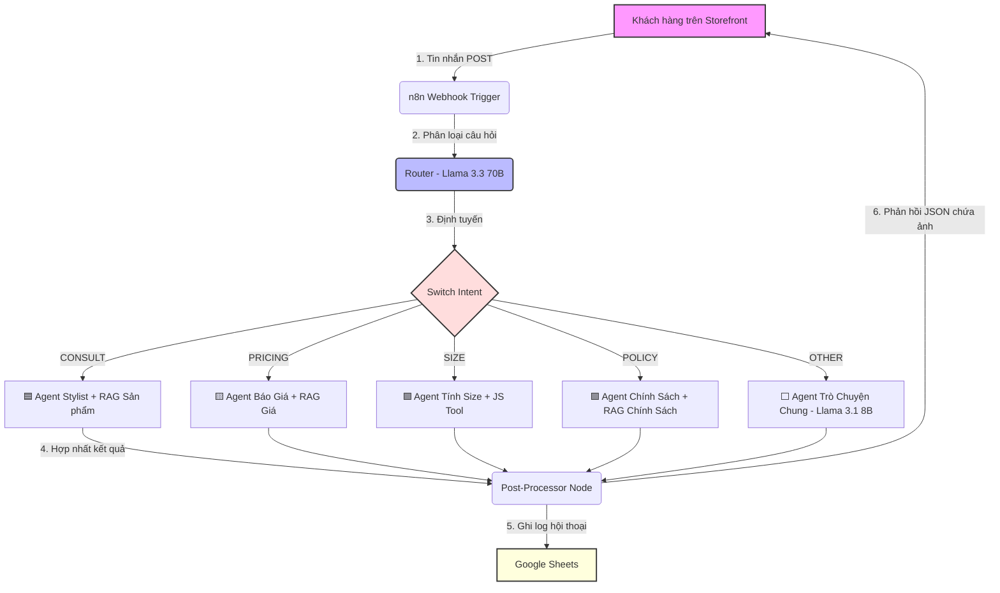

# Cẩm Nang Cấu Hình & Vận Hành Velura AI Chatbot RAG System

Tài liệu này tổng hợp toàn bộ thông tin kiến trúc, mã SQL khởi tạo, cấu hình n8n, frontend và các phương án xử lý sự cố thực tế để vận hành hệ thống chatbot tư vấn thời trang Velura.

---

## 🗺️ 1. Sơ Đồ Kiến Trúc Hệ Thống (Multi-Agent Hybrid)

Hệ thống sử dụng kiến trúc **Multi-Agent** phân vai thông minh để tối ưu hóa tính chính xác trong từng phân khúc nghiệp vụ:



### Chi tiết các Agent & Mô hình hoạt động:
*   **Router – Phân Loại Intent (`llama-3.3-70b-versatile`):** Có nhiệm vụ phân tích tin nhắn cuối của khách hàng và gán đúng nhãn intent (`CONSULT`, `PRICING`, `SIZE`, `POLICY`, `OTHER`). Nhờ chạy model 70B với `temperature: 0`, độ chính xác phân loại đạt gần như tuyệt đối.
*   **Sub-Agents nghiệp vụ (Llama 3.3 70B & Llama 3.1 8B):**
    *   `Agent Stylist`, `Agent Báo Giá`, `Agent Tính Size`, `Agent Chính Sách`: Sử dụng model lớn `llama-3.3-70b-versatile` để đảm bảo khả năng gọi tool (Function Calling) ổn định, không bị lỗi JSON hoặc lệch tham số.
    *   `Agent Trò Chuyện Chung`: Sử dụng model nhẹ `llama-3.1-8b-instant` để trả lời nhanh các câu hỏi xã giao thông thường.
*   **Post-Processor Code:** Node JavaScript phân tích câu trả lời cuối của Agent để phát hiện SKU (ví dụ: `TS001`, `SM002`) và đính kèm thông tin hình ảnh sản phẩm tương ứng vào chuỗi JSON phản hồi về frontend.

---

## 🗄️ 2. Cơ Sở Dữ Liệu Supabase (Vector DB)

Dữ liệu sản phẩm và chính sách từ file Excel nguồn `velura-chatbot/data_chatbot.xlsx` được nhúng bằng mô hình **Google Gemini Embedding (768 chiều)** và đẩy lên Supabase. Bảng dữ liệu và hàm tìm kiếm tương đồng trên Supabase được cấu hình chuẩn như sau:

```sql
-- Xóa cấu hình cũ tránh xung đột
drop function if exists match_documents;
drop table if exists documents;

-- Tạo bảng documents
create table documents (
  id bigint primary key generated always as identity,
  content text,
  metadata jsonb,
  embedding vector(768)
);

-- Tạo hàm tìm kiếm tương đồng Cosine
create or replace function match_documents (
  query_embedding vector(768),
  match_count int default null,
  filter jsonb default '{}'
) returns table (
  id bigint,
  content text,
  metadata jsonb,
  similarity float
)
language plpgsql
as $$
begin
  return query
  select
    documents.id,
    documents.content,
    documents.metadata,
    1 - (documents.embedding <=> query_embedding) as similarity
  from documents
  where documents.metadata @> filter
  order by documents.embedding <=> query_embedding
  limit match_count;
end;
$$;
```

---

## ⚡ 3. Cấu Hình n8n Workflow & Đồng Bộ Tool

Để n8n và Groq thực thi chức năng gọi hàm RAG chính xác, các node Vector Store của Supabase **phải được cấu hình tường minh** thuộc tính `toolName`:

*   Node **`tim_san_pham`**: Bắt buộc đặt `toolName` = `tim_san_pham`.
*   Node **`tim_gia`**: Bắt buộc đặt `toolName` = `tim_gia`.
*   Node **`tim_chinh_sach`**: Bắt buộc đặt `toolName` = `tim_chinh_sach`.

> [!WARNING]
> Nếu các node Vector Store này thiếu thuộc tính `toolName` trong bảng cấu hình parameters, mô hình Groq sẽ không nhận diện được công cụ để kích hoạt và sẽ trả về chuỗi văn bản thô dạng `<function=tim_san_pham>...` trực tiếp trên khung chat của khách hàng.

---

## 💻 4. Thiết Kế Trực Quan & Tương Tác Frontend

Giao diện Web Chat của Velura đã được tối ưu hóa sâu sắc nhằm mang lại trải nghiệm mượt mà nhất:
1.  **Hiển thị ảnh trực tiếp trong bong bóng chat:** Bỏ khung sidebar cồng kềnh bên trái; thay vào đó, bất kỳ khi nào bot nhắc tới sản phẩm, hình ảnh sản phẩm tương ứng sẽ được tự động kết xuất và hiển thị ngay bên dưới câu trả lời của bot trong dòng hội thoại.
2.  **Lược bỏ các màn hình trung gian:** Loại bỏ hoàn toàn chế độ Guest/User mode. Khi người dùng mở trang web, khung chat sẽ hiển thị ngay lập tức để tương tác trực tiếp.
3.  **Chế độ Offline Fallback thông minh:** Khi n8n bị tắt hoặc mất kết nối, frontend `app.js` sẽ tự động chuyển sang chế độ dự phòng cục bộ, quét văn bản khách hàng để phát hiện các mã SKU cơ bản (như TS001, SM001) và hiển thị thông tin sản phẩm mẫu cùng hình ảnh minh họa để không làm gián đoạn trải nghiệm demo.

---

## 🔍 5. Xử Lý Các Sự Cố Thường Gặp (Troubleshooting)

| Lỗi gặp phải | Nguyên nhân | Cách xử lý |
| :--- | :--- | :--- |
| **Rò rỉ mã hàm thô (`<function=...>`)** | Node công cụ RAG trên n8n bị mất cấu hình `toolName` trong JSON parameters. | Mở cấu hình node RAG đó trên n8n, kiểm tra trường **Tool Name** và nhập đúng tên định danh của node (ví dụ: `tim_san_pham`). |
| **Lỗi `429 Rate Limit Exceeded` từ Groq** | Tài khoản Groq miễn phí bị vượt giới hạn số từ trong 1 phút (TPM) do sử dụng model lớn `llama-3.3-70b-versatile` nhiều lần liên tiếp. | 1. Tạm dừng chat trong 1 phút để reset giới hạn.<br>2. Đối với môi trường thử nghiệm liên tục, có thể vào n8n đổi tạm model của một số Sub-Agent sang `llama-3.1-8b-instant`. |
| **Lỗi lệch số chiều vector (`768 and 3072`)** | Node **Google Gemini Embeddings** trên n8n hoặc script Python `embed_data_supabase.py` sử dụng nhầm mô hình nhúng mới (như `text-embedding-004` - 3072 chiều) so với bảng Supabase (768 chiều). | Đảm bảo cả hai nơi đều sử dụng model nhúng chuẩn: `models/embedding-001` (hoặc `models/gemini-embedding-001`) để có đúng 768 chiều vector. |
| **Web không nhận file JS mới** | Trình duyệt lưu cache file `app.js` cũ. | Nhấn tổ hợp phím **`Ctrl + F5`** (Windows) hoặc **`Cmd + Shift + R`** (Mac) để ép trình duyệt tải lại toàn bộ tài nguyên mới nhất. |
| **Sai lệch dữ liệu giá / mô tả sản phẩm** | Có sự nhầm lẫn giữa file Excel `data_chatbot.xlsx` ở thư mục gốc và file Excel chuẩn ở thư mục `velura-chatbot/`. | Luôn chỉnh sửa và chạy script Python với file Excel nằm trong thư mục `velura-chatbot/` để nạp dữ liệu chuẩn xác lên Supabase. |
